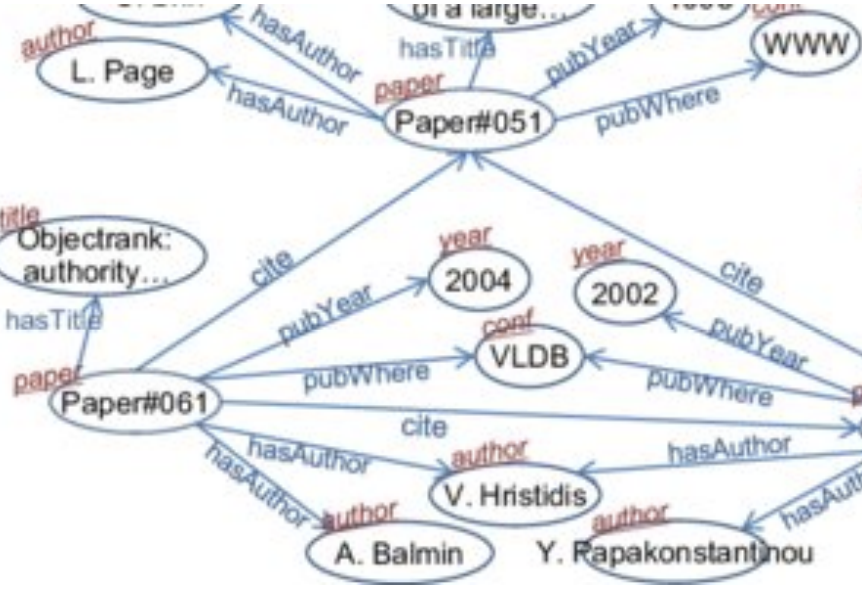
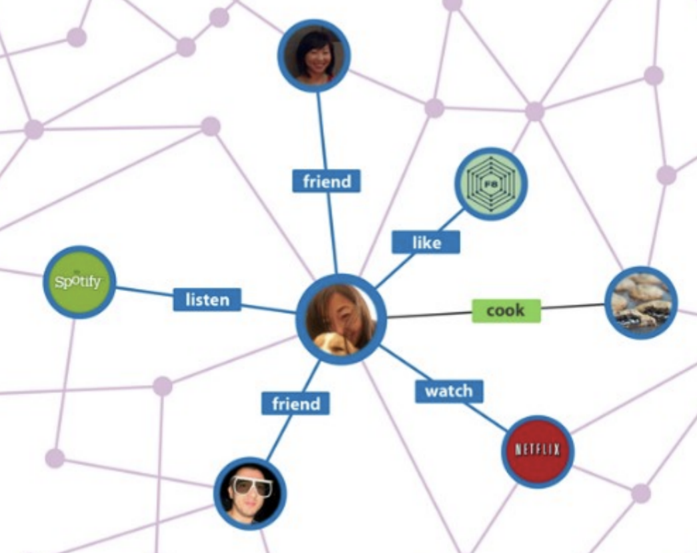

A knowledge graph (KG) represents a collection of interlinked entities and their relationships in a particular knowledge domain. We often use KGs in chatbots, question answering, and enhancing search engine performance. In this section, we will start by showing some examples of KGs, followed by exploring KG-completion techniques and finish with reasoning over KGs using graph queries and box embeddings.

## Introduction to Knowledge Graphs

There are three pieces of information we care about in a knowledge graph:
* **Entities** are the nodes in the graph.
* Labels describe the **type** of the nodes.
* Edges between two nodes capture **relationships** between entities.

Here are two examples of KGs:

Bibliographic KG with node **types**: paper, title, author, conference, year.
And the **relations** are: pubWhere, pubYear, hasTitle,
hasAuthor, cite

Social KG with node **types**: account, song, post, food, channel.
And the **relations** are: friend, like, cook, watch, listen.

## Knowledge Graph Completion
There are lots of publicly available KGs that we could use ([WikiData](https://www.wikidata.org/wiki/Wikidata:Main_Page), [FreeBase](https://developers.google.com/freebase), etc.) They may have rich entities with labels, but many of the relationships between entities are missing. Having human to label all relationship will be very costly, therefore it is worth to explore KG-completion techniques to predict the missing relationships.
### KG Representation
Before we dive into graph-completion methods we need to define how to represent an edge in a KG. An edge in a KG is represented as a **triple $$(h, r, t)$$** such that $$h$$ and $$t$$ are entities and $$r$$ is the relation. The representation of an edge can be read as: **head(h) has relation(r) with tail(t)**.
Our goal is to model entities and relations in the embedding space. Specifically, give a triple $$(h, r, t)$$ can we find a vector representation of $$(h, r)$$ that is close to $$t$$.

There are three types of relation patterns that we are interested in:
* Symmetric Relations: 

 $$r(h,t) \Rightarrow r(t,h) \forall h, t$$
 
 For example, the relationships can be family or roommate

* Composition Relations: 

 $$r_1(x,y) \wedge r_2(y,z)  \Rightarrow r_3(x,z) \forall x,y,z$$
 
 For example, my mother’s husband is my father.

* 1-to-N, N-to-1 relations: 

 $$r(h,t_1), r(h,t_2), \cdots, r(h,t_n)  \mbox{ are all true}$$ 
 
 For example, the relation $$r$$ is “StudentsOf”. $$h$$ is the professor. $$t$$ is the student
 
### TransE
Now we will show how to use TranE to 
### TransR

## Graph Queries
### Path Queries
### Conjunctive Queries
## Query2Box: Reasoning with Box Embeddings
